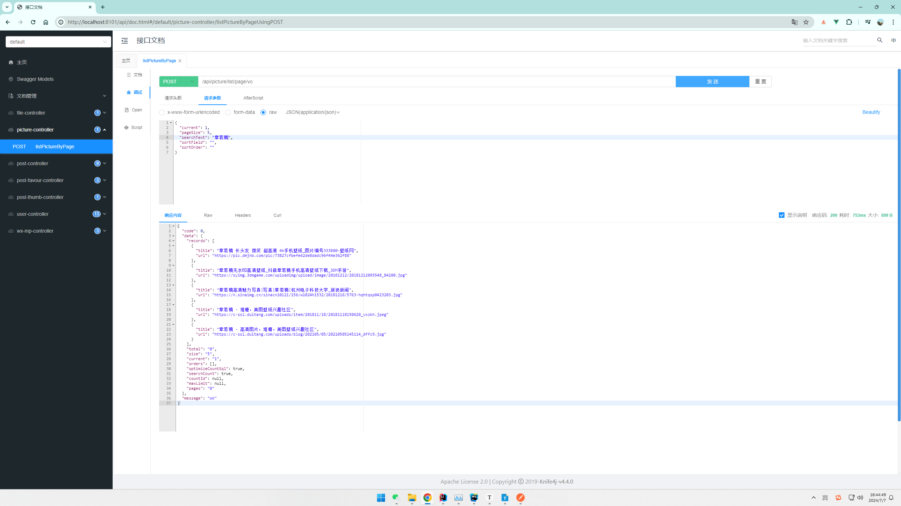
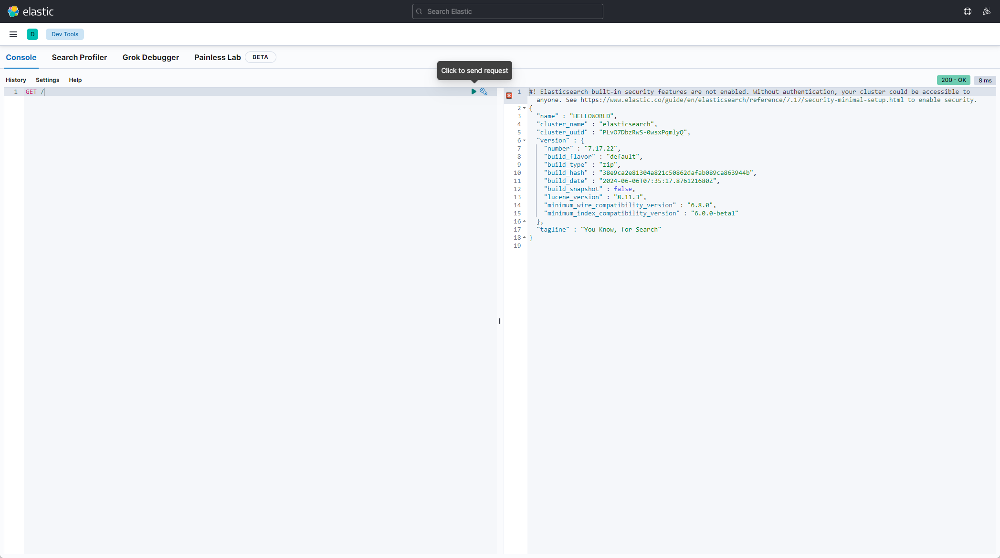
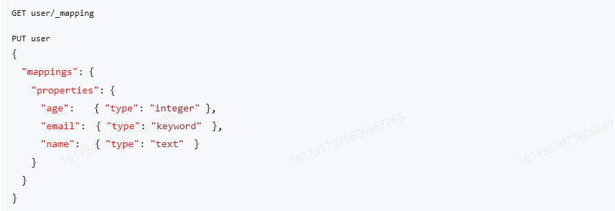
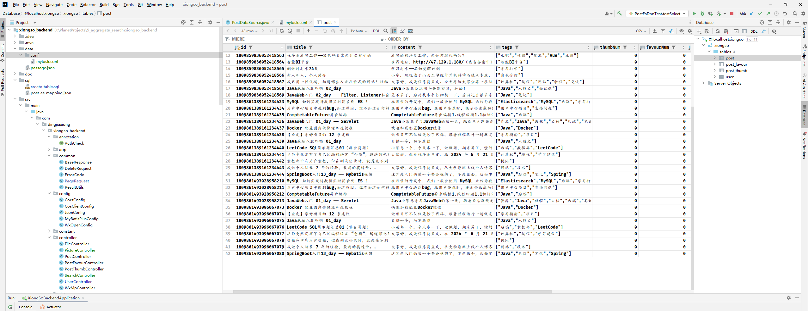
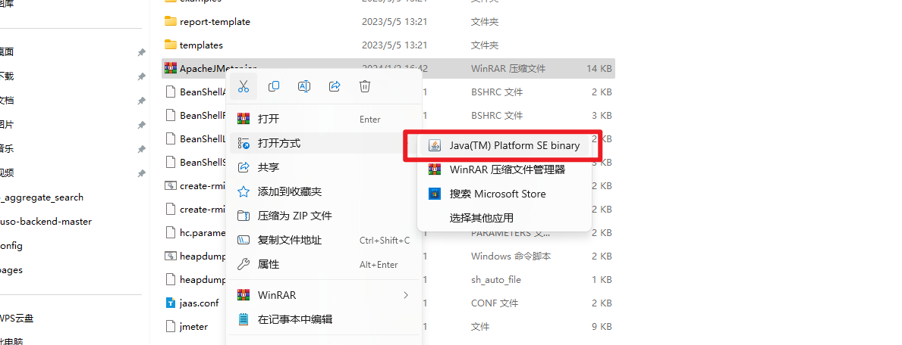
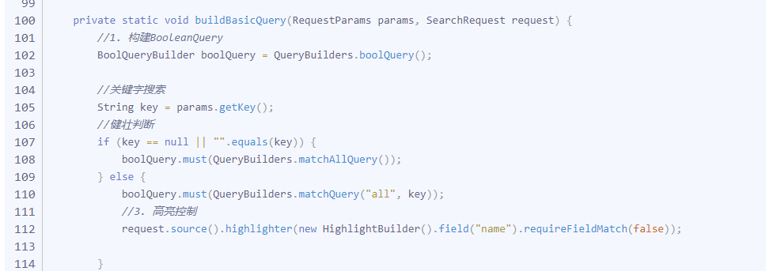

### 聚合搜索平台项目

后端：https://github.com/Ding-Jiaxiong/xiongso_backend

前端：https://github.com/Ding-Jiaxiong/xiongso_frontend

#### 1. 项目介绍


##### 1.1 介绍


一个企业级聚合搜索平台（简化版的搜索中台）。

项目的意义：

- 用户角度：允许用户在同一个页面集中搜索出不同来源、不同类型的内容，提升用户的检索效率和搜索体验。
- 企业角度：当企业有多个项目的数据需要被搜索时，无需针对每个项目单独开发搜索功能，可以直接将数据接入搜索中台，提升开发效率。


##### 1.2 特点


- Vue 3 + SpringBoot 2.7 ，完整前后端
- 实践数据抓取=>数据同步=>搜索引擎等一系列业务开发
- 架构设计知识


##### 1.3 项目技术栈


###### 1.3.1 前端


- Vue
- Ant Design Vue
- Lodash


###### 1.3.2 后端


- Spring Boot
- MySQL
- Elasticsearch (Elastic Stack)搜索引擎
- 数据抓取
    - 离线
    - 实时
- 数据同步(4种同步方式)
    - 定时
    - 双写
    - Logstash
    - Canal
- JMeter压力测试
- Guava Retrying保证API的稳定性？


##### 1.4 业务流程


1. 先得到各种不同分类的数据

2. 提供一个搜索页面（单一搜索+聚合搜索），支持搜索

还可以做一些优化，比如关键词高亮、搜索建议、防抖节流：

项目架构图：


#### 2. 项目开发流程


##### 2.1 前端初始化


###### 2.1.1 前端脚手架使用


这次用的Ant Design Vue 的框架：https://2x.antdv.com/docs/vue/getting-started-cn


版本都没变，`2.2.8`

安装脚手架命令：`npm install -g @vue/cli`


创建项目：` vue create xiongso_frontend`


最后一个我选的`npm`


初始化完成


整合组件库：`npm i --save ant-design-vue@next`


这里好像已经不用自己再install 了，已经执行过了


完整引入：


配置一下语法美化


> 现在默认有vue 了


应用就行


Ctrl + Atl + L，自动美化


直接Serve启动：


擦，离谱


再来一次，开局就是坑


直接成功


初始化完成捏


###### 2.1.2 前端搜索页面开发


只留下了这一个页面，nav 也删掉


计划三个列表：文章、图片、用户


三个列表，美化一下


**记录搜索状态**


目标：用`url`记录页面搜索状态，当用户刷新页面时，能够从`url`还原之前的搜索状态

需要双向同步：`url`<=>页面状态

核心小技巧：把同步状态改成单向，即只允许`url`来改变页面状态，不允许反向


分步聚来实现，思路更清晰：

1. 让用户在操作的时候，改变url地址（点击搜索框，搜索内容填充到url上？切换tab时，也要填充）
2. 当url改变的时候，去改变页面状态（监听的改变）


动态路由


###### 2.1.3 前后端页面联调引入Axios


使用Axios向后端发送请求：https://www.axios-http.cn/docs/intro


步骤：

1. 前端整合Axios
2. 自定义Axios实例
3. 发送请求


`npm install axios`


这里要模拟出一些数据


请求数据并传入组件


用户列表复刻一个


还阔以


##### 2.2 后端初始化


###### 2.2.1 Spring Boot万能模板使用


祭出来吧【新版模板】


改改改


帅气`xiongso` banner


还有包名这些都要改


创建数据库：


执行SQL 文件


用户表和帖子表，老演员了


没问题，直接启动项目吧


要改下版本呢


再来一次


启动成功，访问接口文档


改了下简介


多一个post 请求


注册一个用户先


OK


ID 应该是用了算法了


登录一下


返回用户脱敏信息


获取当前登录用户


没问题


添加一篇帖子，居然用了ChatGPT


妙啊


创建成功


帖子已经插进去了，根据ID 获取


查列表，用户收藏帖子


收藏数


收藏记录


没问题。


###### 2.2.2 ChatGPT生成模拟数据


虽然我觉得没啥必要


不如我手填的【先用接口文档注册用户，然后改的】


还行


##### 2.3 数据源获取


###### 2.3.1 多种方式和抓取流程介绍


**获取不同类型的数据源**


【1】获取文章

内部没有，可以从互联网上获取基础数据=>爬虫

可使用该网站进行测试抓取：https://www.code-nav.cn/learn/passage （注意！仅故测试，不要频繁请求！！！)，获取到文章后要入库。


> 离线抓取：定时获取或者只获取一次


数据抓取的几种方式：

1. 直接请求数据接口（最方便），可使用HttpClient、OKHttp、RestTemplate、Hutool(https:/hutool.cn/)等客户端发送请求
2. 等网页渲染出明文内容后，从前端完整页面中解析出需要的内容
3. 有一些网站可是动态请求的，他不会一次性加载所有的数据，而是要你点某个按钮、输入某个验证码才会显示出数据。可使用无头浏览器：selenium、node.js

注意，爬虫技术不能滥用，千万不要给别人的系统造成压力、不要侵犯他人权益！


这里皮总源码带了


###### 2.3.2 HttpClient接口方式获取文章


数据抓取流程

1. 分析数据源，怎么获取？
2. 拿到数据后，怎么处理？
3. 写入数据库等存储


单元测试类：


运行结果


直接爆掉，今天要稍微改一下


这样就下来了


直接就插进去了


还行。封装成一个任务


直接贴过来就行了


来一次吧，我改了一下current


还行


> 现在是2024年7月7日16:10:25


文章就有数据了【就硬抓】每个网站的用户基本都是自己的，一般无需从站外获取。


【2】 用户获取

每个网站的用户基本都是自己的，就不做了


###### 2.3.3 Jsoup实时获取图片（单元测试）


【3】 图片获取

实时抓取：我们自己的数据库不存这些数据，用户要搜的时候，直接从别人的接口（网站/数据库）去搜。

流程如图：


jsoup解析库：支持发送请求获取到HTML文档，然后从中解析出需要的字段。


单元测试方法：


添加依赖：

```xml
<!-- https://mvnrepository.com/artifact/org.jsoup/jsoup -->
<dependency>
    <groupId>org.jsoup</groupId>
    <artifactId>jsoup</artifactId>
    <version>1.15.3</version>
</dependency>
```


单元测试：


没问题


###### 2.3.4 Jsoup实时获取图片（后端接口）


来一个新的控制层


直接接口文档测试一下：





没毛病


##### 2.4 聚合搜索功能


###### 2.4.1 前后端联调


再来一个pictureList


修改一下布局


就这样，然后传入搜索词调用接口


防盗链，基本上还是能用的


但是现在的问题就是写的太死，而且每次都同时调用了三个接口

目前是在页面加载时，调用三个接口分别获取文章、图片、用户数据。


几种不同的业务场景：

- 其实可以用户点某个tab的时候，只调用这个tab的接☐
- 如果是针对聚合内容的网页，其实可以一个请求搞定，比如：https:/tophub.today/
- 有可能还要查询其他的信息，比如其他数据的总数，同时给用户反馈，比如B站搜索页


我们要根据实标情况去洗择方式！


###### 2.4.2 接口开发（异步编排)


目前设计存在的问题：

1. 请求数量比较多，可能会收到浏览器的限制
2. 请求不同接口的参数可能不一致，增加前后端沟通成本
3. 前端写调用多个接口的代码，重复代码


**聚合接口**


【1】请求数量比较多，可能会收到浏览器的限制=>用一个接口请求完所有的数据（后端可以并发，几乎没有并发数量限制）


【2】请求不同接口的参数可能不一致，增加前后端沟通成本=>用一个接口把请求参数统一，前端每次传固定的参数，后端去对参数进行转换


统一返回结果：比如都使用Page页面封装


【3】前端写调用多个接口的代码，重复代码=>用一个接口，通过不同的参数去区分查询的数据源


来一个新的controller


现在是单独同时查三个，看看时间


给关键词查，468 ms


用个并发


快了一点点， 也就一点点。【存在偶然性，也和数据有关系】


> 注意，并发不一定更快！可能存在短板效应。要以实际测试结果为准！


##### 2.5 聚合搜索优化


###### 2.5.1 统一标准


思考：怎么样让前端又能一次搜出所有数据、又能够分别获取某一类数据(比如分页场景)


解决方案：

新增type字段：前端传type调用后端同一个接口，后端根据type调用不同的service查询


比如前端传递type=user,后端执行`userService.query`


来个枚举


OK， 修改controller


逻辑：

1. 如果type为空，那么搜索出所有的数据
2. 如果type不为空
    - 如果type合法，那么查出对应数据
    - 否则报错


问题：type增多后，要把查询逻辑堆积在controller代码里么？

本质：怎么上搜索系统更轻松地接入更多的数据源？


###### 2.5.2 门面模式


介绍：帮助我们用户（客户端）去更轻松地实现功能，不需要关心门面背后的细节。

聚合搜索类业务基本都是门面模式：即前端不用关心后端从哪里、怎么去取不同来源、怎么去聚合不同来源的数据，更方便地获取到内容。


改造前端


> 这一节讲的真的太乱了


这里有点小问题吧


开始传入的


这个东西很明显是个空值啊，这里可以加一个全局来的时候第一次进行一次调用


只有切换的时候，才有值，后面应该会改的


把接口抽出来封装：


在外层直接调用了就可以


抽出来的东西本质上就是一个门面


> 当调用你系统（接口）的客户端觉得麻烦的时候，你就应该思考，是不是可以抽象一个门面了。


做到这里，这里用8080 直接没有路由进页面的时候，会出现请求参数错误，因为那会儿activeKey 还没有值


###### 2.5.3 适配器模式


【1】定制统一的数据源接入规范（标准）：

- 什么数据源允许接入？
- 你的数据源接入时要满足什么要求？
- 需要接入方注意什么事情？


本系统要求：任何接入我们系统的数据，它必须要能够根据关键词搜索、并且支持分页搜索。

通过声明接口的方式来定义规范。


【2】假如说我们的数据源已经支持了搜索，但是原有的方法参数和我们的规范不一致，怎么办？

使用适配器模式：通过转换，让两个系统能够完成对接。


新（类型）数据源接口：


让实现类实现目标接口


想办法让其兼容，就是适配器模式


这样就可以修改我们的门面了


但是这样还是很麻烦，if else 没有干掉


这一坨优化一下啊


通过不同的数据源，初始化不同的适配器，然后统一的进行一次方法调用


在VO 里面加了一个Page 类型的属性


测试一下


拿是拿到了，就是这样就要把前端一块儿改了


当然也可以改这里


这样也OK


###### 2.5.4 注册器模式


提前通过一个map或者其他类型存储好后面需要调用的对象。

效果：替代了if.else.,代码量大幅度减少，可维护可扩展。


来一个数据源仓库：


这样又可以改掉了，在门面直接调用


这样就只剩下5 行了


也不影响前端进行调用


这里还改了一下之前留下的`NLP`


就现在的搜索还存在问题


问题 → 搜索不够灵活


比如搜"鱼皮rapper"无法搜到"鱼皮是rapper”,因为MySQL数据库的like是包含查询。


需要分词搜索


##### 2.6 Elastic Stack实战


###### 2.6.1 ElasticSearch概念及倒排索引原理

Elastic Stack(一套技术栈)

https://www.elastic.co/cn/


包含了数据的整合=>提取=>存储=>使用，一整套！

各组件介绍：


- beats套件：从各种不同类型的文件/应用中采集数据。比如：a,b,c,d,e,aa,bb,cc
- Logstash:从多个采集器或数据源来抽取/转换数据，向es输送。比如：a,bb,cc
- elasticsearch:存储、查询数据
- kibana:可视化es的数据


**【ElasticSearch概念】**

你就把它当成MySQL一样的数据库去学习和理解。

入门学习：

- Index索引=>MySQL里的表(table)
- 建表、增删改查（查询需要花费的学习时间最多）
- 用客户端去调用ElasticSearch(3种)
- 语法：SQL、代码的方法(4种语法)


ES相比于MySQL,能够自动帮我们做分词，能够非常高效、灵活地查询内容。


**索引【倒排索引】**


正向索引：理解为书籍的目录，可以快速帮你找到对应的内容（怎么根据页码找到文章）

倒排索引：怎么根据内容找到文章


###### 2.6.2 ElasticSearch + Kibana安装和调用方式介绍


那我这里也就装`7.17` 吧


elasticsearch：https://artifacts.elastic.co/downloads/elasticsearch/elasticsearch-7.17.22-windows-x86_64.zip

kibana：https://artifacts.elastic.co/downloads/kibana/kibana-7.17.22-windows-x86_64.zip


都是`7.17.22` 【2024年7月7日21:28:23】


都解压出来


直接运行就行


9200 和 9300


`localhost:9200`，看到这就是启动成功了


**ES的几种调用方式**


1. restful API调用（http 请求）


GET请求：http://localhost:9200/

curl可以模拟发送请求：`curl -X GET "localhost:92OO/?pretty"`


ES的启动端口

- 9200:给外部用户（给客户端调用）的端口
- 9300:给ES集群内部通信的（外部调用不了的）


2. kibana dev tools


自由地对ES进行操作（本质也是restful api)

devtools不建议生产环境使用


3. 客户端调用


java客户端、go客户端等。


文档：https://www.elastic.co/guide/en/elasticsearch/client/java-api-client/7.17/_getting_started.html


###### 2.6.3 ElasticSearch + Kibana Dev Tools实战


启动kibana：


kibana 现在已可用，5601 端口





```eql
POST logs-my_app-default/_doc
{
  "@timestamp": "2099-05-06T16:21:15.000Z",
  "event": {
    "original": "192.0.2.42 - - [06/May/2099:16:21:15 +0000] \"GET /images/bg.jpg HTTP/1.0\" 200 24736"
  }
}
```


**ES 的语法**  `DSL`


json格式，好理解；和http请求最兼容，应用最广，也是鱼皮个人比较推荐的


- 建表、插入数据

  

- 查询：DSL 语法：https://www.elastic.co/guide/en/elasticsearch/reference/7.17/query-dsl.html

  

  根据ID 查询

  

- 修改

  

- 删除

    - 删除普通索引

      

    - 删除数据流式索引

      


索引 and 文档，概念清晰


**Mapping**


文档：https://www.elastic.co/guide/en/elasticsearch/reference/7.17/explicit-mapping.html

可以理解为数据库的表结构，有哪些字段、字段类型。

ES支持动态mapping,表结构可以动态改变，而不像MySQL一样必须手动建表，没有的字段就不插入。


显示创建mapping:





###### 2.6.4 ElasticSearch 语法 EQL与SQL


**EQL**


专门查询ECS文档（标准指标文档）的数据的语法，更加规范，但只适用于特定场景 (比如事件流)


官方文档：https://www.elastic.co/guide/en/elasticsearch/reference/7.17/eql.html


示例：


**SQL**

文档：https://www.elastic.co/guide/en/elasticsearch/reference/7.17/sql-getting-started.html


学习成本低，但是可需要插件支特、性能较差

示例：


**编程式脚本 Painless Scripting language**

编程式取值，更灵活，但是学习成本高


###### 2.6.5 Elastic Stack概念（分词器IK 分词器、打分机制）


**Elastic Stack 概念**


ES索引(Index)=>表

ES field(字段)=>列

倒排索引

调用语法(DSL、EQL、SQL等)

Mapping → 表结构

- 自动生成mapping
- 手动指定mapping


**分词器**


指定了分词的规则。


内置分词器：https://www.elastic.co/guide/en/elasticsearch/reference/7.17/analysis-analyzers.html


空格分词器：whitespace

示例：


标准分词规则：standard【默认】


关键词分词器：keyword，就是不分，整句话当做一个专业术语


**IK分词器（ES 插件）**


中文友好，官方仓库：https://github.com/infinilabs/analysis-ik

下载地址：https://github.com/infinilabs/analysis-ik/releases/download/v7.17.18/elasticsearch-analysis-ik-7.17.18.zip


> 这是7.17 版本最新的了【对应`7.x` 就行】


解压到这个目录即可，重启一下


擦，版本不对，issues 解决了，修改配置文件即可


这里还有个办法：https://release.infinilabs.com/analysis-ik/stable/


这里面有任意版本的ik，6


OK 了，再来一次


这次成功了，而且加载了我们的插件


简单使用一下：


> 思考：怎么样让k按自己的想法分词？
>
> 解决方案：自定义词典（自己尝试）


`ik_smart`和`ik_max_word`的区别？举例："小黑子"

- ik_smart是智能分词，尽量选择最像一个词的拆分方式，比如“小”、“黑子"
- ik_max_word尽可能地分词，可以包括组合词，比如”小黑”、“黑子”


**打分机制**


比如有3条内容：

1. 鱼皮是狗
2. 鱼皮是小黑子
3. 我是小黑子


用户搜索：

- 鱼皮，第一条分数最高，因为第一条匹配了关键词，而目更短（匹配比例更大）
- 鱼皮小黑子=>鱼皮、小、黑子，排序结果：2>3>1


参考文章：https://liyupi.blog.csdn.net/article/details/119176943

官方文档：https://www.elastic.co/guide/en/elasticsearch/guide/master/controlling-relevance.html


##### 2.7 搜索引擎实战


###### 2.7.1 Java操作ES


> 【ES 调用方式】
>
> 3种：
>
> 1. HTTP Restful调用
> 2. kibana操作(dev tools)
> 3. 客户端操作(Java)


**Java 操作ES**


【1】ES官方的Java API

https://www.elastic.co/guide/en/elasticsearch/client/java-api-client/7.17/introduction.html


快速开始：https://www.elastic.co/guide/en/elasticsearch/client/java-api-client/7.17/connecting.html


【2】ES以前的官方Java API,HighLevelRestClient(已废弃，不建议用)

【3】Spring Data Elasticsearch(推荐)

spring-data系列：spring提供的操作数据的框架

- spring-data-redis:操作redis的一套方法
- spring-data-mongodb:操作mongodb的一套方法
- spring-data-elasticsearch:操作elasticsearch的一套方法


官方文档：https://docs.spring.io/spring-data/elasticsearch/docs/4.4.10/reference/html/

自定义方法：用户可以指定接口的方法名称，框架帮你自动生成查询


###### 2.7.2 用ES实现搜索接口（建表 + 增删查改）


1. 建表【建立索引】


文章表表结构如上


ES Mapping:

id(可以不放到字段设置里)

ES中，尽量存放需要用户筛选（搜索）的数据

aliases:别名（为了后续方便数据迁移）

字段类型是txt,这个字段是可被分词的、可模湖查询的；而如果是keyword,只完全匹配、精确查询。

analyzer(存储时生效的分词器)：用ik_max_word,拆的更碎、索引更多，更有可能被搜出来

search_analyzer(查询时生效的分词器)：用ik_smart,,更偏向于用户想搜的分词

如果想要让text类型的分词字段也支持精确查询，可以创建keyword类型的子字段：


建表结构：

这个我一般喜欢用ChatGPT


```dql
PUT post_v1
{
  "aliases": {
    "post": {}
  },
  "mappings": {
    "properties": {
      "title": {
        "type": "text",
        "analyzer": "ik_max_word",
        "search_analyzer": "ik_smart",
        "fields": {
          "keyword": {
            "type": "keyword",
            "ignore_above": 256
          }
        }
      },
      "content": {
        "type": "text",
        "analyzer": "ik_max_word",
        "search_analyzer": "ik_smart",
        "fields": {
          "keyword": {
            "type": "keyword",
            "ignore_above": 256
          }
        }
      },
      "tags": {
        "type": "keyword"
      },
      "userId": {
        "type": "keyword"
      },
      "createTime": {
        "type": "date"
      },
      "updateTime": {
        "type": "date"
      },
      "isDelete": {
        "type": "keyword"
      }
    }
  }
}
```


2. 增删改查


引入依赖：


模板已经引过了

操作实体类：


修改配置：


尝试连接，启动类


没问题，然后是dao 层


第一种方式：`ElasticsearchRepository<PostEsDTO,Long>`,默认提供了简单的增删改查，多用于可预期的、相对没那么复杂的查询、自定义查询，返回结果相对简单直接。

接口代码：


ES中，开头的字段表示系统默认字段，比如`_id`,如果系统不指定，会自动生成。但是不会在`_source`字段中补充id的值，所以建议大家手动指定。

支持根据方法名自动生成方法，比如：


测试一下：


直接运行


返回ID，kibana 看看


没问题，再查一下


第二种方式：Spring默认给我们提供的操作es的客户端对象`ElasticsearchRestTemplate`，也提供了增删改查，它的增删改查更灵活，适用于更复杂的操作，返回结果更完整，但需要自己解析。


对于复杂的查询，建议用第二种方式。


三个步骤：

1. 取参数
2. 把参数组合为ES支特的搜索条件
3. 从返回值中取结果


###### 2.7.3 用ES实现搜索接口（查询DSL）


查询DSL参考文档：

- https://www.elastic.co/guide/en/elasticsearch/reference/7.17/query-filter-context.html
- https://www.elastic.co/guide/en/elasticsearch/reference/7.17/query-dsl-bool-query.html


示例代码：


wildcard模糊查询

regexp正则匹配查询

查询结果中，score代表匹配分数

建议先测试DSL、再翻译成Java


直接用上这个方法，在之前写的门面里面


啥也没出来

动静分离设计：先模湖筛选静态数据，查出数据后，再根据查到的内容 id 去数据库查找到动态数据。【虽然啥也没出，直接跳到数据同步】


###### 2.7.4 数据同步完善


##### 2.8 数据同步


###### 2.8.1 Logstash和Canal


一般情况下，如果做查询搜索功能，使用ES来模糊搜索，但是数据是存放在数据库MySQL里的，所以说我们需要把MySQL中的数据和ES进行同步，保证数据一致（以MySQL为主）。

MySQL=>ES(单向)

首次安装完ES,把MySQL数据全量同步到ES里，写一个单次脚本

4种方式，全量同步（首次）+增量同步（新数据）：


1. 定时任务，比如1分钟1次，找到小ySQL中过去几分钟内（至少是定时周期的2倍）发生改变的数据，然后更新到ES。
    - 优点：简单易懂、占用资源少、不用引入第三方中间件
    - 缺点：有时间差
    - 应用场景：数据短时间内不同步影响不大、或者数据几乎不发生修改
2. 双写：写数据的时候，必须也去写ES;更新删除数据库同理。（事务：建议先保证MySQL写成功，如果ES写失败了，可以通过定时任务+日志+告警进行检测和修复（补偿）)
3. 用Logstash数据同步管道（一股要配合kafka消息队列+beats采集器）：
4. Canal监听MySQL Binlog,实时同步


**Logstash**

传输和处理数据的管道


官方文档：https://www.elastic.co/guide/en/logstash/7.17/getting-started-with-logstash.html


好处：用起来方便，插件多

缺点：成本更大、一般要配合其他组件使用（比如kafka)


下载地址：https://artifacts.elastic.co/downloads/logstash/logstash-7.17.22-windows-x86_64.zip


这个版本还是和我自己的对上


解压出来


简单测试一下：https://www.elastic.co/guide/en/logstash/7.17/first-event.html


```bash
cd logstash-7.17.22
.\bin\logstash.bat -e "input { stdin { } } output { stdout {} }"
```


当然这是标准输入【从键盘】，标准输出【从命令行】


也可以自定义配置

监听udp 并输出：


要把MySQL同步给Elasticsearch。


`mysql 驱动` 在本地的maven 仓库里面可以找到


> 
>
> 做个备份


```conf
input {
    jdbc {
        jdbc_driver_library => "D:\Develop\Maven\maven-repository\mysql\mysql-connector-java\8.0.29\mysql-connector-java-8.0.29.jar" 
        jdbc_driver_class => "com.mysql.jdbc.Driver"
        jdbc_connection_string => "jdbc:mysql://localhost:3306/xiongso"
        jdbc_user => "root"
        jdbc_password => "root"
        statement => "SELECT * from post where updateTime > :sql_last_value
        and updateTime < now() order by updateTime desc"
        tracking_column => "updatetime"
        tracking_column_type => "timestamp"
        use_column_value => true
        parameters => { "favorite_artist" => "Beethoven" }
        schedule => "*/5 * * * * *"
        jdbc_default_timezone => "Asia/Shanghai"
    }
}
filter {
    mutate {
    rename => {
            "updatetime" => "updateTime"
            "userid" => "userId"
            "createtime" => "createTime"
            "isdelete" => "isDelete"
        }
        remove_field => ["thumbnum", "favournum"]
    }
}
output {
    stdout { codec => rubydebug }
        elasticsearch {
        hosts => "127.0.0.1:9200"
        index => "post_v1"
        document_id => "%{id}"
    }
}
```


执行一下：


`logstash.bat -f ..\config\mytask.conf`


应该是成功了，ES 查一下


一共是42 条





和我的数据库是一致的


> 预编译SQL 的优点：
>
> 1. 灵活
> 2. 模板好懂
> 3. 快（有缓存）
> 4. 部分防注入


###### 2.8.2 Canal和配置Kibana可视化看板


**订阅数据库流水的同步方式 Canal**


https://github.com/alibaba/canal/


优点：实时同步，实时性非常强

原理：数据库每次修改时，会修改biog文件，只要监听该文件的修改，就能第一时间得到消息并处理

canal:帮你监听binlog,并解析binlog为你可以理解的内容。

它伪装成了MySQL的从节点，获取主节点给的binlog


快速开始：https://github.com/alibaba/canal/wiki/QuickStart


> 这里其实并没有完全实现


添加依赖


```xml
        <!--        https://github.com/alibaba/canal/wiki/ClientExample-->
        <dependency>
            <groupId>com.alibaba.otter</groupId>
            <artifactId>canal.client</artifactId>
            <version>1.1.0</version>
        </dependency>
```


要先有一个服务端


> 这个我就不做了【感觉这东西Bug 挺多，而且也没有后续，监听到了，就可以自定义要做的事情了】


他确实可以监听到数据库的改变


**配置kibana 可视化看板**


1. 创建索引
2. 导入数据
3. 创建索引模式
4. 选择图表、拖拉拽
5. 保存


回到dashboard


反正就是拖拖拖


##### 2.9 Jmeter压力测试和搜索高亮（拓展点）


官方文档：https://jmeter.apache.org/

下载：https://dlcdn.apache.org//jmeter/binaries/apache-jmeter-5.6.3.zip


直接启动这个jar 包即可


双击没出，我用了`java -jar xxx.jar` 命令，哦哦哦，我这儿把他定义成了默认用解压工具打开 了





这样就行了


配置线程组=>请求头=>默认请求=>单个请求=>响应断言=>聚合报告/结果树


保存


我把他放在这儿了


再来个请求默认值


添加真实请求


再来断言


再来监听器


再来个聚合报告


直接执行


10 次请求


99%分位：99%的用户邹在这个响应时间内

吞吐量：每秒处理的请求数qps


Jmeter 插件：https://jmeter-plugins.org/install/Install/


**搜索建议**

官方文档：https://www.elastic.co/guide/en/elasticsearch/reference/7.17/search-suggesters.html


**搜索高亮**


官方文档：https://www.elastic.co/guide/en/elasticsearch/reference/7.17/highlighting.html


前端就可以根据这个东西， 给`em` 标签加上样式即可，这个以前黑马旅游那个项目做过https://blog.csdn.net/weixin_44226181/article/details/128230766


这个就修改一下请求的逻辑即可，加上高亮的控制





高亮、建议都可以从返回值里拿到。


**前段防抖节流**


问题：用户频案输入、频繁点搜索按钮怎么办？

解决：使用lodash工具库实现防料和节流。

节流：每段时间最多执行x次（比如服务器限流）https://www.lodashjs.com/docs/lodash.throttle

防抖：等待一段时间内没有其他操作了，才执行操作（比如输入搜索）https://www.lodashjs.com/docs/lodash.debounce


**接口稳定性优化**


问题：调用第三方接口不稳定怎么办？（比如bing接口）

使用guava-retrying库实现自动重试：https://github.com/rholder/guava-retrying


> 这个在手搓RPC 项目里面用过


其实这个项目到这儿就结束了。 ... 挺草率的


最后解决一下之前留下的一个小问题吧，8080 直接进页面时，请求会参数错误


第一次请求的请求头，只有页和页大小


在这儿直接强行给他带上就行


这样就行了。


